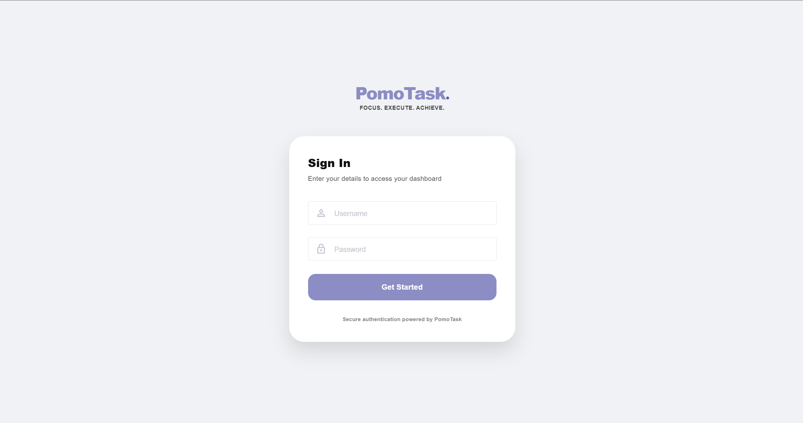
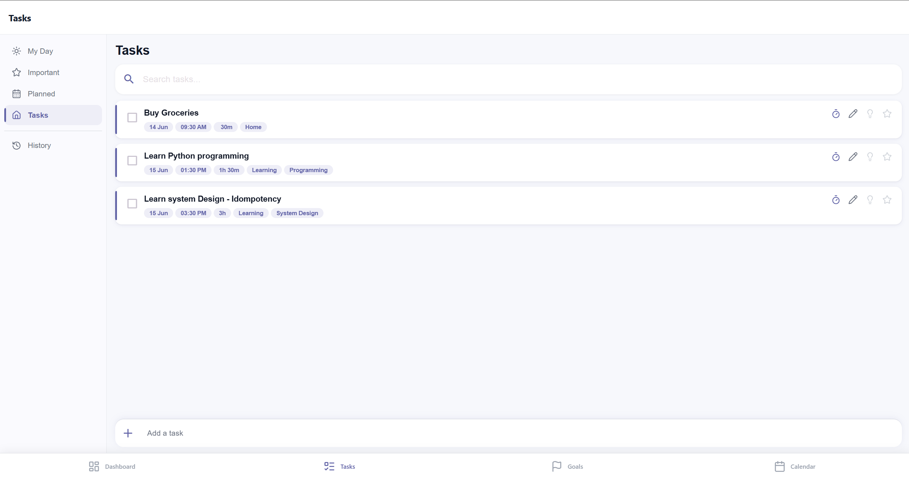
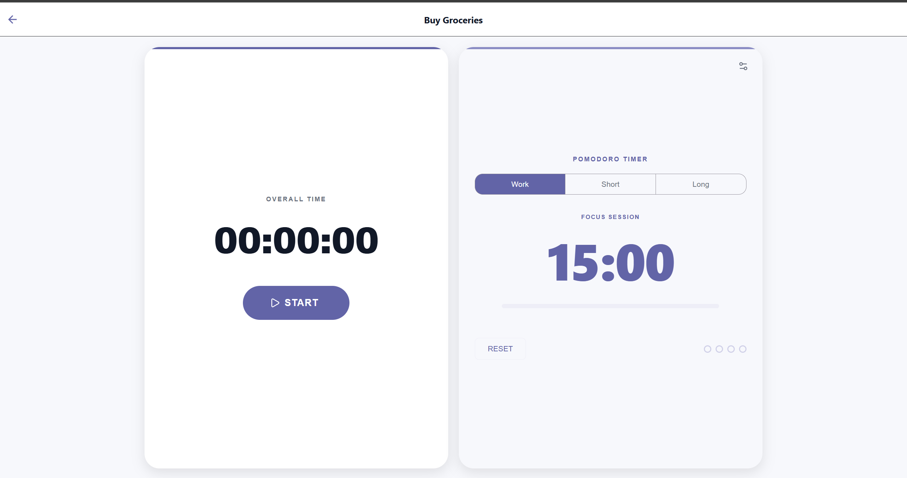
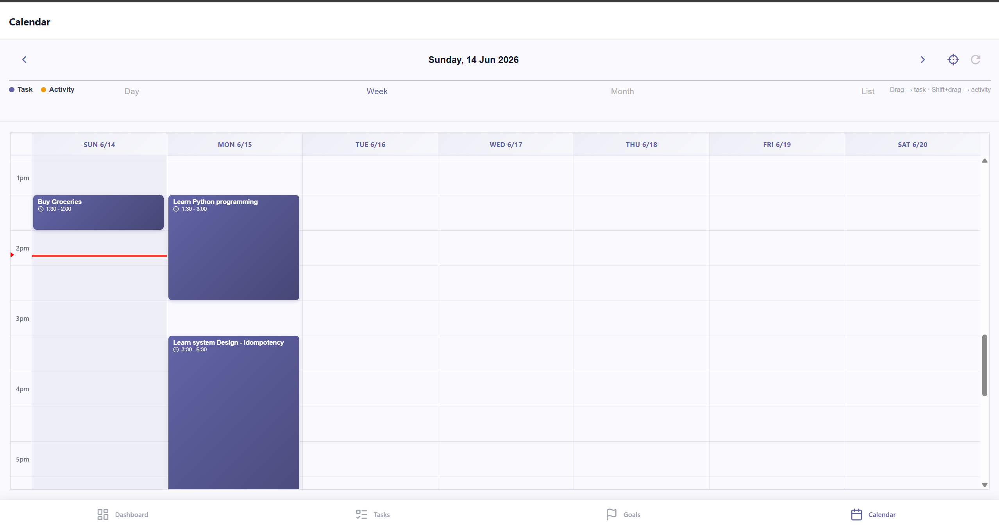
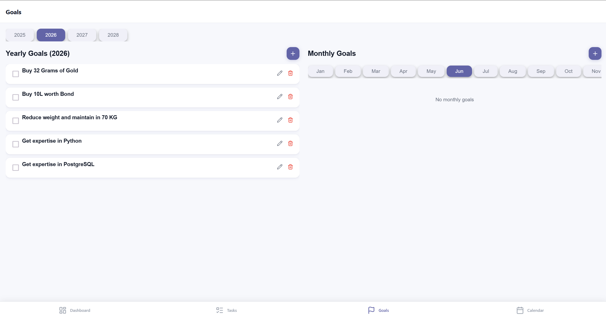

# PomoTask

A full-stack productivity app combining **Pomodoro time tracking**, **task management**, **goal planning**, and a **calendar** view — built with React Native (Expo) on the frontend and Django REST Framework + MongoDB on the backend.

---

## Screenshots

### Login


### Tasks


### Pomodoro Timer


### Calendar


### Goals


---

## Features

### Task Management
- Create, edit, and complete tasks with a quick-add bar at the bottom
- Filter tasks by **My Day**, **Important**, **Planned**, and **History**
- Tag tasks and pin tags to the home sidebar for quick filtering
- Per-task metadata: due date, planned date, time range, time estimate, tags
- Mark tasks as important (starred) or part of My Day (lightbulb)

### Pomodoro Timer
- Per-task overall time tracker (hours:minutes:seconds stopwatch)
- Built-in Pomodoro cycle: 4 focus sessions → long break (auto-advance)
- Configurable focus / short break / long break durations via settings modal
- Progress bar and cycle indicators
- Timer state synced to the backend so it persists across sessions
- Audio alert when a session ends

### Calendar
- FullCalendar integration with **Day**, **Week**, **Month**, and **List** views
- Tasks and activities rendered as colour-coded events
- **Drag-and-drop** to reschedule tasks (snaps to 15-minute intervals)
- Click or drag an empty slot to create a task; **Shift + drag** to log an activity
- Live "now" indicator

### Goals
- **Yearly goals** — set objectives for the year; browse across multiple years
- **Monthly goals** — break yearly goals into monthly milestones; browse by month
- Animated progress bars on the dashboard show monthly goal completion
- Full CRUD with inline edit/delete

### Analytics Dashboard
- Pie chart: **Planned vs Unplanned** tasks
- Pie chart: **Today's Progress** (Todo vs Done)
- Monthly goals progress list with animated bars

---

## Tech Stack

### Frontend
| Library | Purpose |
|---|---|
| React Native 0.81 + Expo 54 | Cross-platform mobile & web app |
| Expo Router 6 | File-based routing |
| React Native Paper | Material Design UI components |
| FullCalendar 6 | Interactive calendar (web) |
| react-native-chart-kit | Pie charts |
| Lucide React Native | Icon set |
| Axios | HTTP client |
| dayjs | Date manipulation |

### Backend
| Library | Purpose |
|---|---|
| Django 4.1 | Web framework |
| Django REST Framework 3.15 | REST API |
| MongoDB + djongo / mongoengine | Database |
| PyJWT | Authentication |
| APScheduler | Background job scheduling |
| Google API Python Client | Google Calendar integration |
| Docker | Containerised deployment |

---

## Project Structure

```
Pomotask/
├── react-native/          # Expo React Native frontend
│   ├── app/
│   │   ├── (tabs)/
│   │   │   ├── index.tsx      # Tasks screen
│   │   │   ├── dashboard.tsx  # Analytics dashboard
│   │   │   ├── goals.tsx      # Goals screen
│   │   │   └── calendar.tsx   # Calendar screen
│   │   ├── pomodoro.tsx       # Pomodoro timer
│   │   └── login.tsx          # Login screen
│   ├── components/            # Reusable UI components
│   ├── src/                   # API clients, contexts, utilities
│   └── assets/                # Images, sounds
│
├── django/                # Django REST backend
│   ├── Task/              # Task app (CRUD, timer, tags)
│   ├── Goal/              # Goal app (yearly & monthly)
│   ├── General/           # Dashboard & analytics
│   ├── PomoTask/          # Project settings
│   ├── Dockerfile
│   └── requirements.txt
│
└── screenshots/           # App screenshots (add yours here)
```

---

## Getting Started

### Backend

```bash
cd django

# Create and activate virtual environment
python -m venv .venv
.venv\Scripts\activate      # Windows
# source .venv/bin/activate # macOS/Linux

pip install -r requirements.txt

# Configure environment variables (see .env.example)
python manage.py migrate
python manage.py runserver
```

Or with Docker:

```bash
cd django
docker.bat        # Windows helper script
# or: docker build -t pomotask-api . && docker run -p 8000:8000 pomotask-api
```

### Frontend

```bash
cd react-native
npm install

npm run web       # Run in browser
npm run android   # Run on Android
npm run ios       # Run on iOS (macOS only)
```

---

## Adding Screenshots

Place your screenshots in the `screenshots/` folder using these filenames:

| File | Screen |
|---|---|
| `screenshots/login.png` | Login screen |
| `screenshots/tasks.png` | Tasks list |
| `screenshots/pomodoro.png` | Pomodoro timer |
| `screenshots/calendar.png` | Calendar view |
| `screenshots/goals.png` | Goals screen |
| `screenshots/dashboard.png` | Analytics dashboard |
